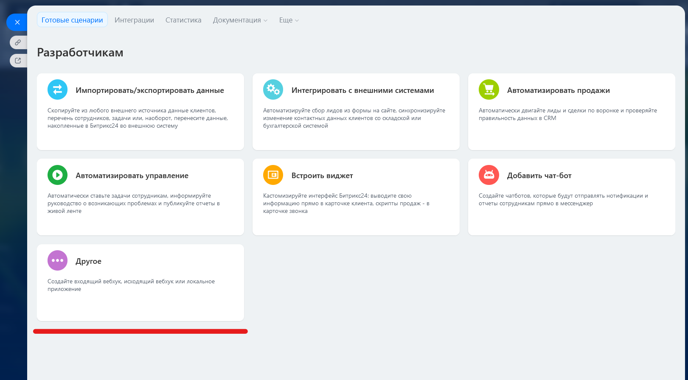
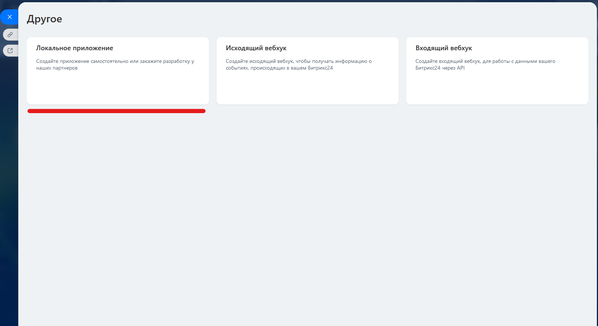
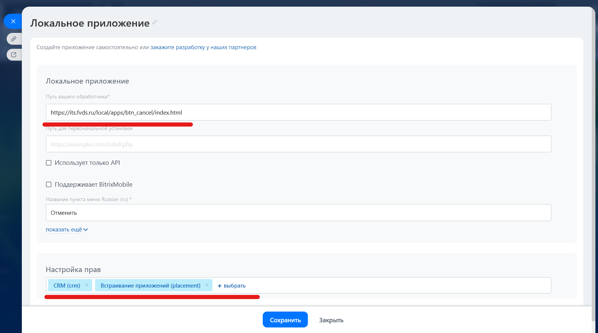
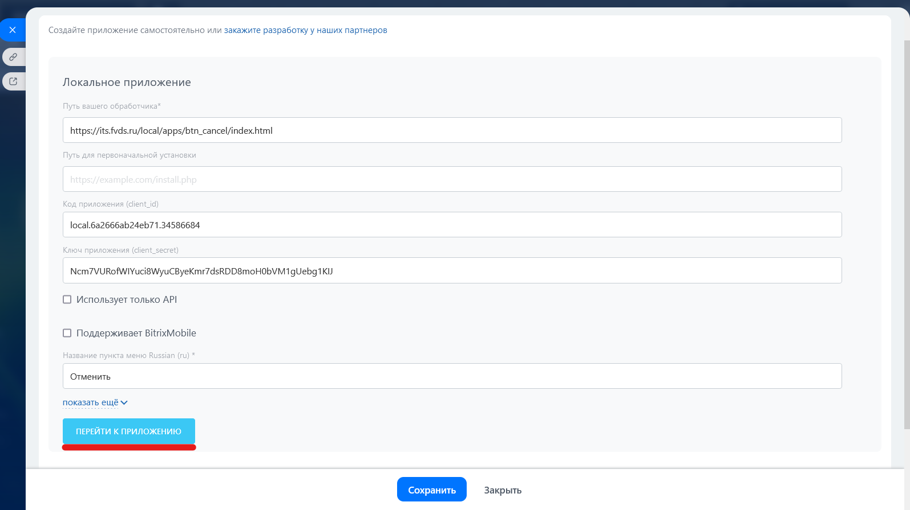
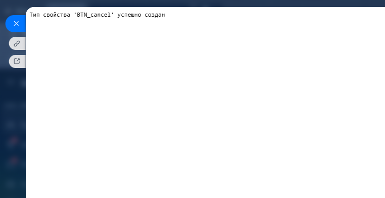
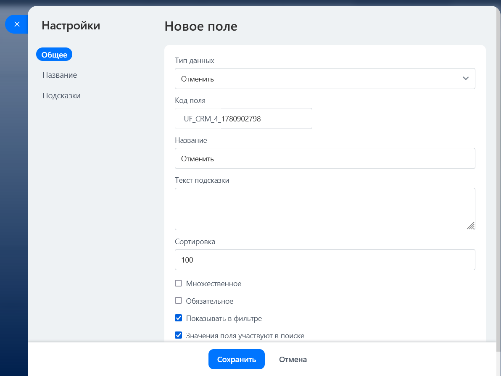
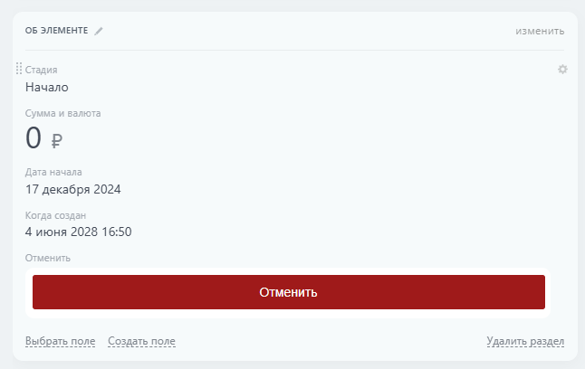

# Доработка с кнопкой запуска БП с отменой процессов
[Исходный код (пример приложения)](/local-app-cancelbp/local-app/)

[Ссылка на пример приложения на портале](https://bitrix.octobergroup.ru/bitrix/admin/fileman_admin.php?lang=ru&&path=%2Flocal%2Fapps%2Fbtn_cancel_approval&site=s1)

[Пример изменений для новой сущности](#пример-изменений-для-новой-сущности)

[Подключение нового приложения](#подключение-нового-приложения)

Одно локальное приложение работает для одной сущности, выглядит код примерно одинаково, отличаются настройками


# Пример изменений для новой сущности

- В файле [configs.php](/local-app-cancelbp/local-app/configs.php) нужно указать необходимые параметры
    ```
    // ID смарт-процесса
    'SMART_PROCESS_ID' => ID_SP,

    // ID шаблона бизнес-процесса
    'BP_TEMPLATE_ID' => ID_BP,

    // Текст кнопки
    'BUTTON_TEXT' => 'Отменить согласование',

    // Цвет кнопки
    'BUTTON_COLOR' => '#9f1a1a',

    // Текст кнопки при запуске БП
    'BUTTON_LOADING_TEXT' => 'Запущена отмена согласования',

    ```

- Загрузить папку с приложением в [/local/apps](https://bitrix.octobergroup.ru/bitrix/admin/fileman_admin.php?PAGEN_1=1&SIZEN_1=20&lang=ru&path=%2Flocal%2Fapps&site=s1&fu_action=)

- В [index.html](/local-app-cancelbp/local-app/index.html) поменять настройки для установки нового типа поля 

    ```
    var handlerUrl = 'https://bitrix.octobergroup.ru/local/apps/название_папки_с_новым_приложением/index.php';
    // Указать новый тип свойства
    var type = 'BTN_cancel_new';
    var propCode = 'BTNcancelnew';
    // Указать новое название свойства
    var title = 'Отменить new';
                
    ```
- Произвести подключение нового приложения

# Подключение нового приложения

После размещения в папке apps папки с приложением нужно установить его

- [x] Перейти в раздел Разработчикам - Другое

- [x] Перейти в опцию Локальное приложение

- [x] Указать путь до index.html и задать права CRM, встраивание приложений

- [x] После сохранения перейти к приложению

- [x] Автоматически будет произведена установка нового типа поля

- [x] Создать поле в нужном смарт-процессе с новым типом

- [x] Вывести поле в карточке смарт-процесса 

